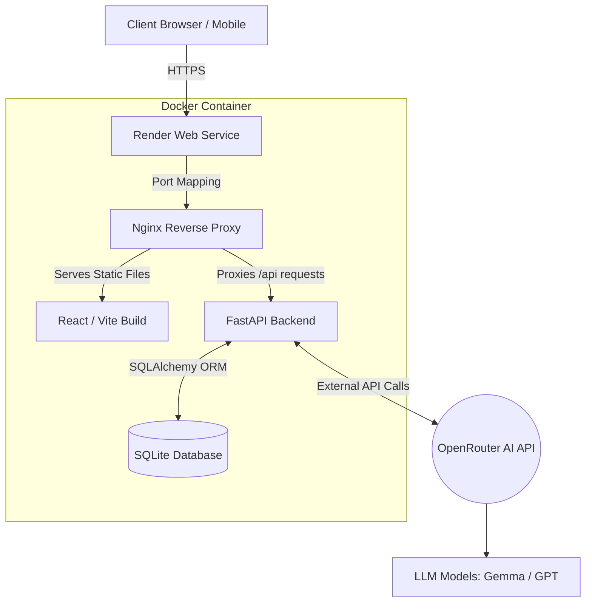

# FitPilot AI

### IBM SkillsBuild Gen AI & Cloud Computing Internship
**BharatCares**

**Team Name:** [Insert Team Name]  
**Team Members:** [Insert Team Members]  
**College:** [Insert College Name]  
**Date:** [Insert Date]  

---

## Executive Summary

FitPilot AI is a comprehensive, AI-powered health and fitness application designed to provide users with highly personalized training and nutrition guidance. Acting as a digital personal trainer, the application leverages generative artificial intelligence to create custom workout plans, analyze meal macronutrients, and offer conversational coaching. 

Built using a modern technology stack (React frontend, FastAPI backend) and containerized with Docker, FitPilot AI is deployed as a robust, single-container architecture on Render. The integration of AI solves the critical issue of generic fitness advice by providing adaptable, goal-oriented, and data-driven recommendations that evolve as the user progresses.

---

## Problem Statement

The fitness technology landscape is fragmented. Individuals pursuing health goals frequently encounter the following issues:
- **Generic Workout Plans:** Most fitness applications offer static, templated routines that fail to account for a user's specific experience level, equipment availability, or time constraints.
- **Lack of Personalization:** Nutrition advice is often generalized, leaving users without actionable insights into their daily macronutrient intake.
- **Fragmented Tooling:** Users are forced to switch between multiple applications for tracking workouts, logging weight, generating plans, and calculating calories.
- **Manual Data Entry:** Tracking performance milestones (like Personal Records) typically requires tedious manual input, leading to inconsistent data tracking.

These barriers reduce adherence to fitness programs and prevent users from achieving optimal results. 

---

## Objectives

1. **Centralize Fitness Tracking:** Provide a unified platform where users can manage their workouts, nutrition, and physical metrics.
2. **Leverage AI for Personalization:** Utilize advanced Large Language Models (LLMs) to generate dynamic, user-specific workout routines and dietary feedback.
3. **Automate Performance Metrics:** Implement intelligent background processing to automatically detect and log Personal Records (PRs) without manual user intervention.
4. **Achieve Cloud-Native Scalability:** Containerize the application for seamless, highly available deployment using industry-standard DevOps practices.

---

## Proposed Solution

FitPilot AI addresses these challenges by serving as an intelligent ecosystem for fitness management. Upon registration and onboarding, the platform captures the user's physical metrics, goals, dietary preferences, and experience level. 

The implemented workflow allows users to interact with an AI Coach for real-time advice, generate customized weekly workout schedules, and log daily exercises. As users log their workouts, the backend intelligently parses the data to update their analytics dashboard and automatically records any new Personal Records achieved. Simultaneously, the AI Meal Planner allows users to input natural language descriptions of their meals, which the AI analyzes to extract exact macronutrient profiles (Calories, Protein, Carbs, Fats) and provide actionable dietary suggestions.

---

## Key Features

1. **User Authentication & Onboarding:** Secure JWT-based authentication system. An interactive onboarding wizard captures essential demographics, fitness goals, and physical metrics.
2. **Interactive Dashboard:** A centralized control panel displaying real-time statistics, recent workouts, and active goals.
3. **AI Workout Generator:** Generates structured, multi-day workout routines formatted in Markdown based on user goals, available equipment, and time constraints.
4. **AI Meal Planner:** Accepts natural language food descriptions, extracts nutritional data (macros) via AI, and logs them into a daily nutrition tracker.
5. **Smart Workout Logger:** A step-by-step interactive interface for logging exercises, sets, reps, and RPE (Rate of Perceived Exertion).
6. **Automated Personal Records (PR Lab):** A strictly read-only dashboard that automatically updates whenever a user logs a workout containing a weight that exceeds their historical maximum.
7. **Progress Analytics & Weight Tracker:** Visual charts (powered by Recharts) that map the user's weight trends and workout frequency over time.
8. **Responsive UI:** A modern, mobile-first design built with Tailwind CSS, featuring glassmorphism elements, dynamic interactions, and a dark-themed aesthetic.

---

## Technology Stack

| Component | Technology / Tool |
| :--- | :--- |
| **Frontend** | React 19, Vite, TailwindCSS, React Router, Recharts, Lucide Icons |
| **Backend** | Python, FastAPI, SQLAlchemy, Pydantic, Passlib, Uvicorn |
| **Database** | SQLite (Relational SQL Database) |
| **Artificial Intelligence** | OpenRouter API (Gemma, Laguna, OpenAI models) |
| **Containerization** | Docker, Docker Compose |
| **Web Server / Proxy** | Nginx |
| **Cloud Deployment** | Render (Web Services) |

---

## System Architecture

---

## Development Methodology

The project was executed using an agile, iterative approach:

1. **Planning & UI/UX Design:** Defined the core user flows, database schema, and aesthetic guidelines (dark mode, premium modern UI).
2. **Backend Development:** Built robust RESTful APIs using FastAPI, establishing JWT authentication, and integrating SQLAlchemy for database management.
3. **API Integration:** Implemented the `AIService` module to communicate with OpenRouter, utilizing custom system prompts to force strict JSON responses for nutrition tracking and Markdown for workout plans.
4. **Frontend Development:** Developed modular React components, integrated Axios for API communication, and utilized Context API for global state management.
5. **Dockerization:** Configured a multi-stage `Dockerfile`. Stage 1 builds the React frontend using Node.js. Stage 2 sets up Python, installs backend dependencies, copies the React build to Nginx, and uses a custom `start.sh` entrypoint to run both FastAPI and Nginx simultaneously.
6. **Testing & Refinement:** Automated the Personal Record (PR) tracking system by writing backend logic to intercept logged exercises and update historical maximums dynamically.
7. **Deployment:** Deployed the containerized application to Render, establishing continuous deployment from the GitHub `main` branch.

---

## Challenges & Solutions

- **Challenge:** *AWS App Runner Compatibility*  
  **Resolution:** Initially targeted for AWS App Runner, the project required a single-container architecture. We re-engineered the deployment pipeline to bundle the frontend build, Nginx, and FastAPI into a single Docker image, ensuring compatibility with platforms that expose only a single port.
  
- **Challenge:** *Render Nginx Configuration & Dynamic Ports*  
  **Resolution:** Render injects a dynamic `$PORT` environment variable at runtime. Standard Nginx configurations fail because they require a hardcoded port. We resolved this by writing a `start.sh` script that uses `envsubst` to dynamically inject the Render port into the `nginx.conf` template before starting the server.

- **Challenge:** *Node.js Dependency Conflicts*  
  **Resolution:** During containerization, older versions of Node.js failed to build the Vite/React frontend due to modern dependency requirements. We updated the Docker base image to Node 22, successfully resolving the build errors.

- **Challenge:** *Manual PR Logging UX*  
  **Resolution:** Users initially had to manually log Personal Records. This was tedious and prone to errors. We refactored the backend `workouts.py` router to automatically cross-reference historical logs and update the database if a new maximum weight is detected, transforming the UI into a fully automated dashboard.

- **Challenge:** *Caching Issues in the Frontend*  
  **Resolution:** The PR Lab occasionally displayed stale data due to aggressive browser/Nginx caching on the `GET /api/prs` route. We resolved this by appending a timestamp query parameter to bust the cache and ensuring trailing slashes were respected.

---

## Expected Impact

FitPilot AI democratizes access to personalized fitness coaching. It is designed for:
- **Beginners** who need structured guidance and educational workout plans.
- **Intermediate/Advanced Lifters** who require meticulous tracking of Personal Records and workout history.
- **Health-conscious Individuals** who want to seamlessly track their macronutrients without relying on extensive manual food databases.

By removing the friction of manual tracking and planning, the application encourages consistency and helps users achieve their health goals efficiently.

---

## Future Scope

While the current application is fully functional, future iterations could include:
- **Mobile Application:** Developing a React Native counterpart for native iOS and Android experiences.
- **Wearable Integration:** Syncing data from Apple Health, Google Fit, and Garmin devices.
- **Advanced Analytics:** Incorporating machine learning to predict fatigue or recommend deload weeks based on RPE trends.
- **Social & Community Features:** Allowing users to share workouts or compete on leaderboards.
- **Push Notifications:** Reminders for meals, hydration, and scheduled workouts.

---

## Project Resources

- **Live Demo:** [https://fitpilot-ai-vm2o.onrender.com](https://fitpilot-ai-vm2o.onrender.com)
- **GitHub Repository:** [https://github.com/anasahmed06/FitPilot-AI](https://github.com/anasahmed06/FitPilot-AI)
- **Google Drive Source Code:** <Insert Google Drive Folder Link>

---

## References

1. **React:** Meta Platforms, Inc. (2025). *React Documentation*. Retrieved from https://react.dev/
2. **FastAPI:** Ramírez, S. (2025). *FastAPI Documentation*. Retrieved from https://fastapi.tiangolo.com/
3. **OpenRouter:** OpenRouter. (2025). *Unified LLM API Documentation*. Retrieved from https://openrouter.ai/docs
4. **Docker:** Docker Inc. (2025). *Docker Documentation*. Retrieved from https://docs.docker.com/
5. **SQLite:** SQLite Consortium. (2025). *SQLite Official Documentation*. Retrieved from https://www.sqlite.org/docs.html
6. **Render:** Render. (2025). *Render Web Services Documentation*. Retrieved from https://render.com/docs
